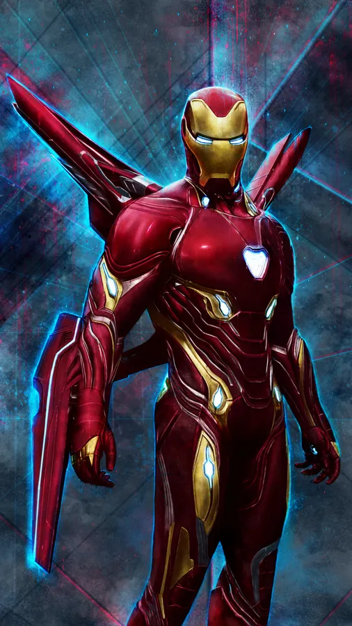
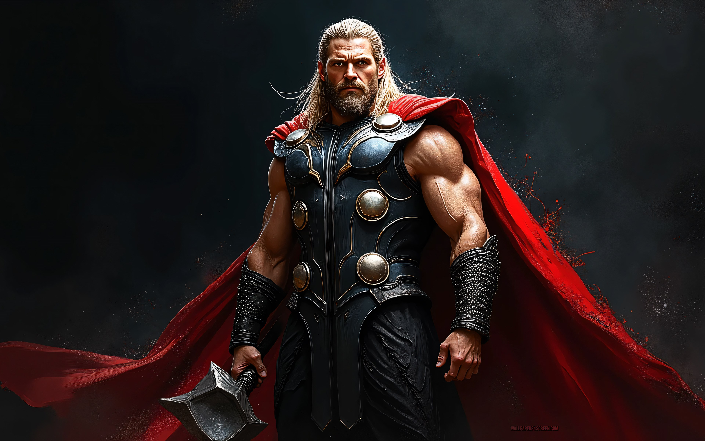
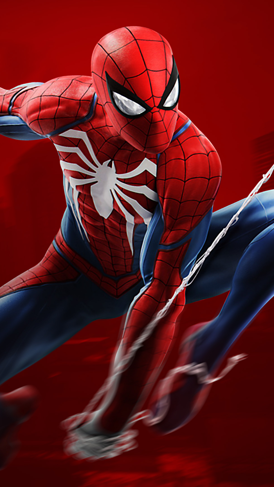
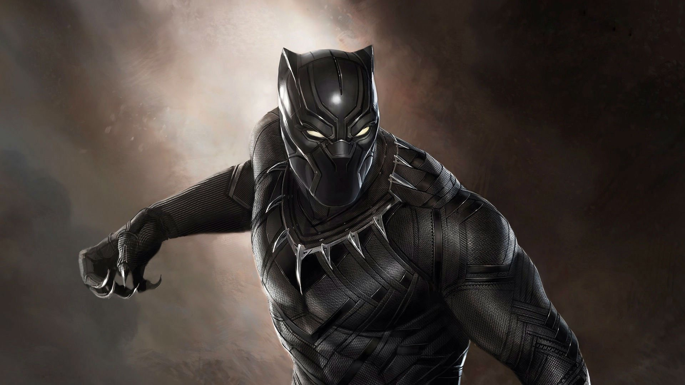
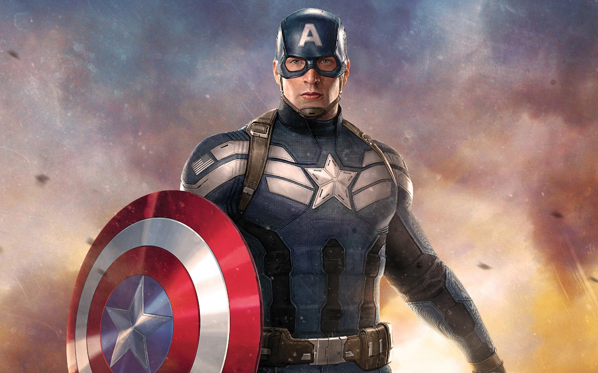

<p align="center">
  
  
  
  
  
</p>

<h1 align="center">⚡ MARVEL AVENGERS SHOWCASE ⚡</h1>

<p align="center">
  <a href="https://github.com/Sjking2025/marvel_avengers_showcase/stargazers">
    
  </a>
  <a href="https://github.com/Sjking2025/marvel_avengers_showcase/forks">
    
  </a>
  <a href="https://github.com/Sjking2025/marvel_avengers_showcase/releases">
    
  </a>
  <a href="https://github.com/Sjking2025/marvel_avengers_showcase/blob/main/LICENSE">
    
  </a>
</p>

<p align="center">
  
  
  
</p>

---

<p align="center">
  ✨ <strong>The Ultimate Marvel Superhero Experience</strong> ✨<br/>
  A cinematic, scroll-driven 3D showcase featuring your favorite Avengers with Apple-level polish and React Bits magic.
</p>

<p align="center">
  <a href="https://sjking2025.github.io/marvel_avengers_showcase/">
    
  </a>
</p>

---

## 🎬 Features

<table>
  <tr>
    <td width="50%">
      
### ⚡ Interactive Tilt Cards
3D cards that respond to your mouse movement - **feel the depth!**     

### 🌟 Spotlight Glow Effects
Dynamic lighting follows your cursor creating **immersive ambiance**

### 🚀 Hyperspeed Background
Experience the **sci-fi speed lines** effect like traveling at light speed

### 🔮 Aurora Gradients
Beautiful animated background gradients that **flow and shimmer**

### 📱 Fully Responsive
Works perfectly on **desktop, tablet & mobile**

### 🦸 5 Iconic Avengers
- Iron Man - Genius. Billionaire. Avenger.
- Thor - God of Thunder. Worthy.
- Spider-Man - Friendly. Neighborhood.
- Black Panther - King of Wakanda.
- Captain America - I can do this all day.

### ✨ Smooth Animations
Scroll-triggered reveal animations with GSAP

### 🎯 Real Stats
Interactive stat cards for each hero

    </td>
    <td width="50%">

### 🛠️ Tech Stack

| Technology | Purpose |
|------------|----------|
| HTML5 | Semantic structure |
| CSS3 | Styling & animations |
| JavaScript | Interactivity |
| GSAP | Smooth scroll animations |
| React Bits UI | Tilt cards, spotlight effects |
| GitHub Pages | Free hosting |

### 🎨 Design System

- **Color Palette**: Dark cinematic theme with hero-specific accents
- **Typography**: Inter (Apple-style clean font)
- **Effects**: Glow, blur, 3D transforms
- **Animations**: Smooth 60fps transitions

    </td>
  </tr>
</table>

---

## 🚀 Quick Start

```bash
# Clone the repository
git clone https://github.com/Sjking2025/marvel_avengers_showcase.git

# Navigate to project
cd marvel_avengers_showcase

# Open in browser
open index.html
# or use a local server
npx serve .
```

---

## 📁 Project Structure

```
marvel_avengers_showcase/
├── index.html              # Main entry point
├── assets/
│   └── heroes/           # Hero images
├── css/                  # Stylesheets
│   ├── animations.css
│   ├── apple.css
│   ├── hero-card.css
│   ├── layout.css
│   ├── navigation.css
│   ├── particles.css
│   ├── reset.css
│   ├── responsive.css
│   ├── tokens.css
│   └── typography.css
└── js/                   # JavaScript
    ├── main.js
    ├── navigation.js
    ├── scroll-engine.js
    ├── hero-data.js
    └── particles/
```

---

## 🎮 Interactive Features

### Mouse Interactions
- **Tilt Card**: Move your mouse over hero cards to see 3D tilt effect
- **Spotlight**: Hover to see dynamic glow following your cursor

### Scroll Interactions
- **Reveal**: Content fades in as you scroll
- **Progress Bar**: Top progress indicator shows read position
- **Smooth Scroll**: Fluid scrolling between sections

### Navigation
- **Pill Nav**: Click to jump to any hero section
- **Active State**: Automatically highlights current section

---

## 🌐 Live Demo

🚀 **Experience it live:** https://sjking2025.github.io/marvel_avengers_showcase/

---

## 🤝 Contributing

Contributions, issues and feature requests are welcome!

1. **Fork** the repo
2. **Create** your branch (`git checkout -b branch-name`)
3. **Commit** your changes (`git commit -m 'Add amazing feature'`)
4. **Push** to the branch (`git push origin branch-name`)
5. **Open** a Pull Request

---

## 📜 License

Licensed under the MIT License - see [LICENSE](LICENSE) for details.

---

## 🙏 Acknowledgments

- [React Bits](https://reactbits.dev) - Amazing UI components
- [GSAP](https://greensock.com/gsap/) - Smooth animations
- [Marvel Entertainment](https://www.marvel.com) - The legends

---

<p align="center">
  
  
</p>

<p align="center">
  <strong>⭐ Star this repo if you enjoyed it!</strong>
</p>

---

<p align="center">
  Made with ⚡ by <a href="https://github.com/Sjking2025">@Sjking2025</a>
</p>

<p align="center">
  <em>"I can do this all day." - Steve Rogers</em>
</p>